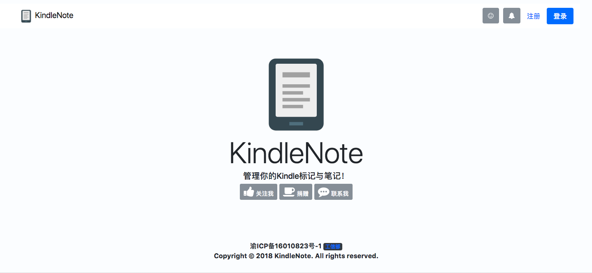
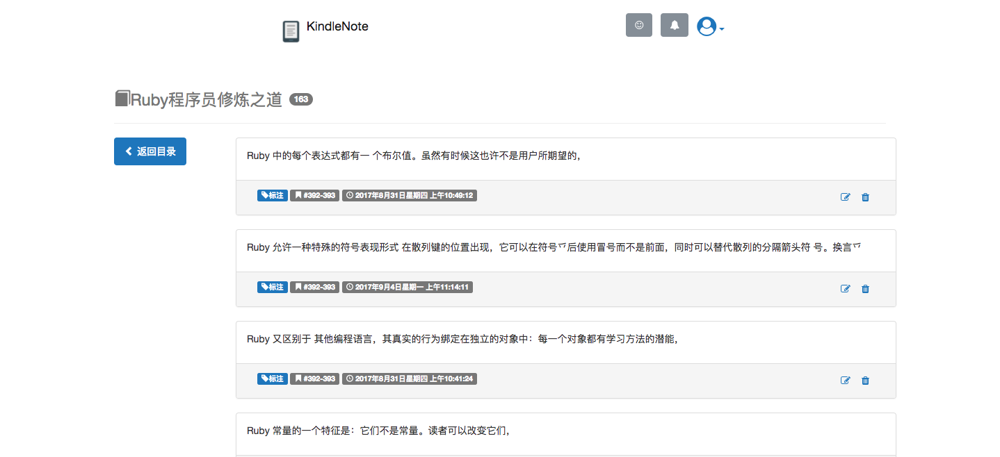

# KindleNote


**KindleNote**可以导出您**Kindle**中的**标注**与**笔记**，并支持将它们转换为**MarkDown**文件。

您可以选择将导出的**标记**与**笔记**存储于**Evernote**、**有道云笔记**等云笔记平台，或者**KindleNote**的服务器中。
## 功能
- [x] **笔记导出为Markdown**
- [x] **笔记保存到Evernote**
- [x] **批量导出为Markdown / 导出到第三方云笔记 / 删除**
- [x] **通过豆瓣图书自动获取笔记对应的图书信息**
- [x] **重复笔记自动合并**
- [x] **第三方登录：QQ**
- [x] **第三方登录：Evernote**
- [ ] **分享到QQ空间、微博等社交网站**
- [ ] **笔记保存到有道云笔记**
- [ ] **搜索笔记**
## 演示
**全部笔记**


**查看笔记**

## 系统架构
**KindleNote**基于**Ruby**的**Ruby on Rails**框架。

系统设计遵循**MVC**与**Restfull**架构。

## 安装
### 服务器要求
* **Ruby** >= 2.4
* **Rails** >= 5.1.4
* **Nodejs** >= 8.6.0
* **Yarn** >= 1.3.2
* **Sqlite3**(默认数据库)
* **Git**(自动化部署时需要)

## 配置
所有配置文件均位于`config`目录
### 配置Evernote授权
**Evernote授权**用于将用户的笔记导出到**Evernote**。

**Evernote**的配置文件为`evernote.yml`
```
development:
  consumer_key: key
  consumer_secret: secret
  sandbox: true
```
以上是*development*运行环境下的**Evernote**配置信息，你可以在该配置文件中添加其他运行环境下的**Evernote**配置信息。

具体的配置信息可参考[evernote-oauth-ruby](https://github.com/evernote/evernote-oauth-ruby/ 'Evernote OAuth')
### 配置QQ授权
**QQ授权**便于用户使用QQ进行快速登录。

**QQ**的配置文件为`qq_secrets.yal`
```
APP_ID: 'xxx'
APP_KEY: 'xxxxxxxx'
RED_URL: 'http://www.kindlenote.org/qq/callback'
```
进入[QQ互联](https://connect.qq.com/manage.html 'QQ互联')，在成功创建应用后，你将得到QQ授权的配置信息。
## 部署
使用[Capistrano](http://capistranorb.com/ 'Capistrano')实现自动化部署，默认会自动从<https://github.com/BadTudou/KindleNote-Rails>拉取最新的代码。

你可参照[Deploying a Rails App on CentOS 7 with Capistrano, Nginx, and Puma](https://hieunguyentrung.com/2017/06/29/deploying-a-rails-app-on-centos-7-with-capistrano-nginx-and-puma/ 'Deploying a Rails App on CentOS 7 with Capistrano, Nginx, and Puma')这篇文章完成其在服务器的部署。

**注意：自动化部署时，你需要链接以下配置文件**
* database.yml 
* application.yml 
* evernote.yml 
* qq_secrets.yml

以下代码是以远程服务器**develop**用户的身份执行自动化部署。
```
bundle exec cap development deploy PRODUCTION_BRANCH='develop' PRODUCTION_SERVER_IP='xxx.xxx.xxx.xxx' PRODUCTION_DEPLOY_USER='develop'
```
## 版权
**Copyright (c) 2017-2017 BadTudou.**

**All rights reserved.**
